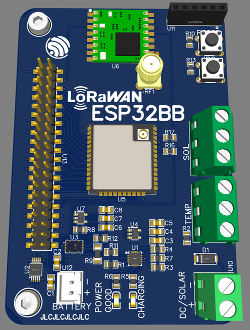

# ESP32BB & Garden Monitor
This project is a little mainboard for the ESP32 packed with some great features! The main idea behind it was to make a ready-to-go board for the ESP32 to fit many projects but two projects kinda got mixed together so for now it also has terminal blocks for waterproof DS18B20 sensors and a custom soil humidity sensor. I plan to remove those and put them back in the project as a kind of add-on board.
# Features
- Battery powered with 1S Li-Ion (18650)
- TI BQ24074 1.5A Charging IC
- TI BQ27441 Fuel Gauge IC
- Dual 3.3V LDO
- TI ADS1015 or ADS1115 for better ADC readings
- HopeRF's RFM95W for LoRa or LoRaWAN
- 40 pins header exposes all pins
- Solar power input (5V to 6V recommended)
- PCB fits [Velleman G311 Enclosure](https://www.velleman.eu/products/view/?id=7346)
# Some Numbers & Neat Things
DeepSleep current between 330uA and 415uA
> I'm trying hard to get better here

LoRaWAN session data is saved to a special part of the flash memory using the [Preferences Library](https://github.com/espressif/arduino-esp32/tree/master/libraries/Preferences) and survives a power loss
> This part is the newest one and will be put to test during the summer of 2023
# Schematics & PCB
[Shared on EasyEDA](https://oshwlab.com/yannickg/bq24074_dc_solar)

# Help and Inspirations
I'm a hobbyist/tinkerer and not an electronics engineer so I designed this to the best of my knowledge and the help of numerous sources from the web so I'm going to list the main ones here.
- [Sparkfun's Battery Babysitter](https://learn.sparkfun.com/tutorials/battery-babysitter-hookup-guide)
- [Jack Gruber's GitHub ESP32-LMIC-DeepSleep-example](https://github.com/JackGruber/ESP32-LMIC-DeepSleep-example)
- [The Things Stack Docs](https://www.thethingsindustries.com/docs/)
